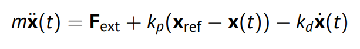
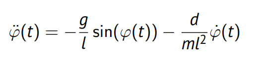
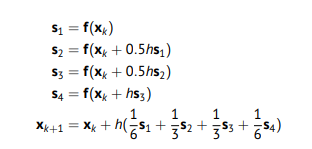

# CER Selbsttestfragen
Hier sind alle Fragen die am Ender jeder Vorlesung stehen gelistet und von mir Beantwortet. <br>
Alle Antworten sind nach besten Wissen und Gewissen, steinigt mich nicht wenn was Falsch ist <br>
Fragen von SoSe 21 <br>
Gruß geht raus an Jan, der die Fragen selbst formuliert aber nicht gescheit in den Foliensätzen beantwortet 

## Vorlesung 0 Grundlagen


### Was ist eine Simulation?
<details>
    <summary>Antwort</summary>
    Eine Simulation ist der Prozess der Modellierung eines echten System und die ausführung von virtuellen experimenten auf diesem. Zweck der Simulation ist entweder das Nachvolziehen des echten Systems oder das Entwickeln von Strategien für die Anwendung des echten Systems
</details>

### Warum und wofür braucht man Simulation?
<details>
    <summary>Antwort</summary>
    Das echte System ist ..
    <li>zu groß oder klein</li>
    <li>zu schnell oder zu langsam</li>
    <li>noch nicht geabaut</li>
    <li>zu gefährlich</li>
    <li>nicht experimentierbar</li>
    <li>zu teuer</li>
    <li>zu stark gestört</li>
</details>

### Was ist ein Modell?
<details>
    <summary>Antwort</summary>
    Im grunde Alles<br>
    Modellierung ist die Beschreibung der Realität. Dabei verbinden Modelle beobachtbare oder messbare Variabeln so das verständliche Muster entstehen
</details>

### Was haben Modelle mit Wissenschaft zu tun?
<details>
    <summary>Antwort</summary>
    Modelle Ermöglichen testbare Vorhersagen und somit die "Scientific Emthod"
</details>

### Mit welchen Schritten erstellt man Modelle für ein System?
<details>
    <summary>Antwort</summary>
    <li>Analytische Modellierung: Modellgleichung basierend auf Expertenwissen aufstellen</li>
    <li>Systemidentification: Bestimmen der Parameter durch Experimente</li>
</details>

### Warum braucht auch die Künstliche Intelligenz Simulationen?
<details>
    <summary>Antwort</summary>
    Künstliche Inteligenzen müssen Trainiert werden, dies passiert meist in einem Simulierten umfeld um die Effizienz zu erhöhen
</details>

### Wofür können Modelle noch genutzt werden?
<details>
    <summary>Antwort</summary>
    Blöde frage eigentlich:
    <li>Kunst</li>
    <li>Sofwareentwicklung</li>
    <li>Produktentwicklung</li>
    <li>Verhaltensprognose/-analyse</li>
    <li>Buchstäblich alles</li>
</details>

### Kannst Du das SIR Modell in Python programmieren?
<details>
    <summary>Antwort</summary>

```python
    import numpy as np
    import matplotlib.pyplot as plt
    def sir(u):
        s, i, r = u
        gamma = 0.17
        betta = 0.23
        du = [
            - (betta * s * i),
            betta * s * i - gamma * i,
            gamma * i
        ]
        du = np.array(du)
        return du

    u0 = [1.0, 0.001, 0.0]
    n = 200
    data = []
    u_old = u0
    data.append(u_old)

    for i in range(200):
        du = sir(u_old)
        tmp = u_old + du
        data.append(tmp)
        u_old = tmp
    plt.plot(data)
    plt.legend(["S","I","R"])
    plt.show()
```
</details>

### Wie könnte ein SIEARS (A=Asymptomatic, zweites S=Rückfälle) aussehen?
<details>
    <summary>Antwort</summary>
    Grundidee: neue konstante für rückfall (rho) und asympt (alpha)<br>
    mehr weiß ich auch nicht

</details>

## Vorlesung 1 Modellierung/ Vorwärtskinematik

### Was sind Eigenvektoren und wozu braucht man die?
<details>
    <summary>Antwort</summary>
    "lambda, v sin Eigenwert und der Dazugegörige Eigenvektor von A gdw Av = lambda v"
    "Eigenvektoren sind nützlich um Matrizen zu diagonalisieren" 

</details>

### Wie geht der Modellierungsloop?
<details>
    <summary>Antwort</summary>

```
    ˍˍˍˍˍˍˍˍˍˍˍˍˍˍˍˍˍˍˍˍˍˍˍˍˍˍ                        ˍˍˍˍˍˍˍˍˍˍˍˍˍˍˍˍˍˍˍˍˍˍˍˍ
    |Problem aus der Realität| -----Modellbildung---> |Mathematisches Problem|
    ¯¯¯¯¯¯¯¯¯¯¯¯¯¯¯¯¯¯¯¯¯¯¯¯¯¯                        ¯¯¯¯¯¯¯¯¯¯¯¯¯¯¯¯¯¯¯¯¯¯¯¯
    ^                                                                   |
    |                                                                   |
    Überprüfung                                     Anwenden der Egrebnisse
    |                                               / Methoden
    |                                                                   |
    |                                                                   v
    ˍˍˍˍˍˍˍˍˍˍˍˍˍˍˍˍˍˍˍˍˍˍˍˍˍˍˍˍˍ                       ˍˍˍˍˍˍˍˍˍˍˍˍˍˍˍˍˍˍˍˍˍ
    |Sachverhalt in der Realität|<--Interpretation------|Lösung des Problems|
    ¯¯¯¯¯¯¯¯¯¯¯¯¯¯¯¯¯¯¯¯¯¯¯¯¯¯¯¯¯                       ¯¯¯¯¯¯¯¯¯¯¯¯¯¯¯¯¯¯¯¯¯
```

</details>

### Wie unterscheiden sich statische und dynamische Modelle?
<details>
    <summary>Antwort</summary>
    Statische Modelle stellen Verschiedene Größen im Modell in Beziehung doer beschreibt eine abhängige Größe mit Hilfe einer anderen, das Model hängt also nur von diesen Größen ab<br>
    Dynamische Modelle hängen von dem jetzigen zustand, dem vorhergegangenen und diesen Werten ab (man betrachtet die ableitungen)
</details>

### Was bedeuten zeitdiskret, ortskontinuierlich, stochastisch?
<details>
    <summary>Antwort</summary>
    <li>zeitdiskret:  Das Modell beschreibt das System für bestimmte abzählbare Zeitpunkte.</li>
    <li>ortskontinuierlich: Das Modell beschreibt das System für kontinuierliche (unendlich viele nicht abzählbare) Orte.</li>
    <li>stockastisch: wahrscheinlich? keine Ahnung steht nicht im Foliensatz</li>
</details>

### Welche Fragestellungen behandelt die Kinematik?
<details>
    <summary>Antwort</summary>
    <li>vorwärts: mit gegebenen Gelenkparameter q: wo steht unser Endeffektor</li>
    <li>rückwärts: mit welchen Gelenkparameter q erreicht unser Endeffektor die position x</li>
</details>

### Wie berechnet man Vorwärtskinematik?
<details>
    <summary>Antwort</summary>
    Pro gelenk wird das Ursprungskoordinatensystem entsprechend der Gelenkparameter rotiert und Verschoben. 
    Die Resultierende Matrix hat nun in den ersten drei Spalten und zeilen die Rotation des Endeffektors und in den letzen Spalte mit (x, y, z, 1)^T die Position des Endeffektors 
</details>

## Vorlesung 2 Inverse Kinematik

### Warum ist inverse Kinematik schwerer als Vorwärtskinematik?
<details>
    <summary>Antwort</summary>
    <li>Vorwärts: eine Explizite Lösung</li>
    <li>invers: unendlich viele Lösungen möglich</li>
</details>

### Wieviel Freitheitsgrade hat ein Auto?
<details>
    <summary>Antwort</summary>
    Drei Freiheitsgrade (auf Ebene Projiziert):
    <li>x</li>
    <li>y</li>
    <li>Fahrzeugorientierung</li>
</details>

### Wenn eine Schlange (mit 200-435 Wirbeln) sich aufrichtet, wiev iele inverse Kinematik-Lösungen hat sie?
<details>
    <summary>Antwort</summary>
    unendlich viele 
</details>


### Was macht das Fixpunktverfahren? Wann konvergiert es?
<details>
    <summary>Antwort</summary>
    <li>Das itterative anwenden einer Funktion auf sich selbst mit startwert x_0</li>
    <li>wenn d(g(x),g(y) <= kd(x, y) für alle x,y in R^n mit k in [0,1)</li>
    <li>also wenn alle eigenwerte der Jacobimatrix kleiner 1 (im Einheitskreis)</li>
</details>

### Was ist das Relaxationsverfahren? Wann ist es besser/schlechter als das Fixpunktverfahren?
<details>
    <summary>Antwort</summary>
    Das Relaxationsverfahren kann die Eigenwerte skallieren, sodass Sie im Einheitskreis liegen. Dies ermöglicht die Konvergenz<br>
    <li>besser: bestimmen von lokaler Konvergenz bei start x weit entfernt von Lösung</li>
    <li>schlechter: bestimmen der globalen Konvergenz</li> 
</details>


### Was macht das Newtonverfahren?
<details>
    <summary>Antwort</summary>
    Das Newtonverfahren ist eine Fixpunktiteration mit adaptiver Relaxationsmatrix
</details>

### Welche Verfahren sind 1. Ordnung, welche zweiter Ordnung?
<details>
    <summary>Antwort</summary>
    FPI und Relaxationsmatrix: 1. Ordnung <br>
    Newton: 2. Ordnung
</details>

### Wie kann ich das Newtonverfahren nutzen um ein Optimierungsproblem max_x s_{Note}(x) zu lösen? Z.B. für s_{Note}(x) = exp(−x) (1 − exp(−x))^{−2}? Tip: Nullstelle von s'_{Note}(x) = 0
<details>
    <summary>Antwort</summary>
    keine Ahnung 
</details>

## Vorlesung 3 Dynamische Modelle

### Was ein typisches Modell für die Federkraft?
<details>
    <summary>Antwort</summary>
    F<sub>Feder</sub> = k<sub>p</sub> (x<sub>ref</sub>-x) <br>
    mit k<sub>p</sub> als Federkonstante
</details>

### Was ein typisches Modell für Reibung?
<details>
    <summary>Antwort</summary>
    F<sub>Dämpfer</sub> = -k<sub>d</sub>x' <br>
    mit k<sub>d</sub> als Dämperfkonstante
</details>

### Wie wirken sich Kräfte auf die Position eines Körpers aus?
<details>
    <summary>Antwort</summary>
    Kräfte ändern die geschwindigkeit eines Körpers und somit auch die Position
</details>

### Wie wirken sich Kräfte auf die Orientierung eines Körpers aus?
<details>
    <summary>Antwort</summary>
    Kräfte können drehmomente erzeugen, welche wiederum den Körper drehen
</details>

### Müssen wir bei Punktmassen die Orientierung modellieren?
<details>
    <summary>Antwort</summary>
    Nein
</details>

### Was ist die Dynamikgleichung eines Feder-Masse-Dämpfer Systems?
<details>
    <summary>Antwort</summary>
    
</details>

### Was ist die Dynamikgleichung eines Pendels?
<details>
    <summary>Antwort</summary>
    
</details>


### Wie kann ich ein einfaches mechanisches System modellieren?
<details>
    <summary>Antwort</summary>
    Freischneidem: betrachten der einzelnen wirkenden Kräfte;
    anschließend aufsummieren
</details>

## Vorlesung 4

### Bestimme die Gleichgewichtslösungen des SIR-Modells? Was kann man den Politikern raten?
<details>
    <summary>Antwort</summary>

</details>

### Kann eine ODE dritter Ordnung auf eine ODE erster Ordnung reduziert werden?
<details>
    <summary>Antwort</summary>
    ja, einführen von einer neuen Zustandsvariable wobei z = (x, x', x'') und somit z' = z(x', x'', x''')

</details>

### Was bedeutet autonom? Was bedeutet zeitinvariant?
<details>
    <summary>Antwort</summary>
    autonom: die Zeit t komm nurnoch parametrisch vor <br>
    zeitinvariant: die zeit kommt nich vor

</details>

### Was ist ein lineares System?
<details>
    <summary>Antwort</summary>
    Bei linearen ODEs ist die Funktion f(x(t), u(t)) linear

</details>

### Wie kann man die Dynamik eines Roboters mit steifen „Links“ aufschreiben?
<details>
    <summary>Antwort</summary>
    als lineare ode 1. Ordnun
</details>

### Wozu braucht man statische Modelle beim Brückenbau und wozu dynamische?
<details>
    <summary>Antwort</summary>
    statisch: wie lang wird meine Brücke, wie viel gewicht hällt sie <br>
    dynamisch: wie verhält sich meine Brücke im Wind
</details>

### Wenn ich eine Brücke beschreiben möchte, was für eine Differentialgleichung brauche ich?
<details>
    <summary>Antwort</summary>
    Partielle DGL 2.Ordnung (?)
</details>

### Was ist ein stationärer Zustand und wie hängt er mit der Gleichgewichtslösung zusammen?
<details>
    <summary>Antwort</summary>
    Ein zustand in dem die beschleunigung und geschwindigkeit = 0 ist. <br>
    eine gleichgewichtslösung ist ein kanidat für einen stationären zustand
</details>

## Vorlesung 5 Stabilität
### Was bedeutet Linearisierung? Wann kann ich sie anwenden?
<details>
    <summary>Antwort</summary>
    Approximieren eines Systems x'(t) = f(x(t), u(t)) in der nähe eines Arbeitspunktes durch eine lineares x' = Ax +Bu<br>
    Kann angewendet werden bei Systemen mit Gleichgewichtslösungen <br>
    nicht anwendbar wenn der AP in einer Unstetigkeit in der 1. oder 2. Ableitung hat (sprung oder knick)
</details>

### Wie kann ich ein lineares System analysieren? Was bedeuten Eigenwerte und -vektoren in diesem Zusammenhang?
<details>
    <summary>Antwort</summary>
    Man kann das system Lösen, dadurch lässt sich bestimen ob das System Osziliert oder stabil ist
</details>

### Was sagt der Imaginärteil der Eigenwerte über Oszillationen aus?
<details>
    <summary>Antwort</summary>
    wenn ein Immaginärteil vorhanden schwingt das System
</details>

### Was sagt der Realteil der Eigenwerte über Stabilität aus?
<details>
    <summary>Antwort</summary>
    nur wenn alle Realteile der Eigenwerte negativ sind schwingt das system nicht
</details>

### Was passiert bei einem linearen System bei Re(λ) = 0 und Im(λ) != 0?
<details>
    <summary>Antwort</summary>
    dauerhafte oszilation
</details>

### Was passiert bei einem nichtlinearen System bei Re(λ) = 0 und Im(λ) != 0?
<details>
    <summary>Antwort</summary>
    oszilation nicht grarantiert
</details>

### Wie sieht das Zeitverhalten eines van der Pol-Oszillators aus?
<details>
    <summary>Antwort</summary>
    zeitinvariant
</details>

## Vorlesung 6 PD Regler

### Kann man per „Software“ eine künstliche Feder oder Dämpferhinzufügen?
<details>
    <summary>Antwort</summary>
        Komt auf den Kontext an. In einer Simulation, klar, der Ganze ablauf ist künstlich.
        Am echten System braucht man eine möglichkeit kräfte wirken zu lassen. Die Programmierte feder könnte z.B anhand eines Bildes des Systems einen Motor steuern und somit
        eine Feder simulieren
</details>

### Was ist der Unterschied zwischen Steuerung und Regelung?
<details>
    <summary>Antwort</summary>
    Steuerung ist zeitabhänig vorbestimmt, Regelung ist nur abhängig vom vorhergehenden Zustand
</details>

### Was ist der Unterschied zwischen Trajektorienregelung und „Set Point“ Regelung?
<details>
    <summary>Antwort</summary>
    Trajektorienregelung ist zeitabhängig, man versucht also in jedem zeitpunkt t x_des(t) nahe x(t) zu erreichen.
    Set point: System soll bis zu zeitpunkt x spätestens stabil sein (?)
</details>

### Was ist ein PD-Regler? Was würde einen PID-Regler ausmachen?
<details>
    <summary>Antwort</summary>
    P = Proportional (die Feder) <br>
    D = Derivative (der Dämpfer) <br>
    I = Integral 
</details>

### Was ist ein Zustandsregler?
<details>
    <summary>Antwort</summary>
    ein PD reger in Matrixfor also u = Kx
</details>

### Was bedeuten open-loop und closed loop?
<details>
    <summary>Antwort</summary>
    open: steuerung; steuergrößen abhängig von Zeit <br>
    closed: Abhängig von zustand x(t) (Feedback)
</details>

### Was bedeutet feedforward und was feedback?
<details>
    <summary>Antwort</summary>
    feedback: Closed-Loop regelung <br>
    feedforward: open-loop Steuerung
</details>

### Wie kann man den geschlossenen Regelkreis als Differentialgleichung beschreiben?
<details>
    <summary>Antwort</summary>
    x' = f(x, u(x))
</details>

### Was ist (über-/unter-)kritische Dämpfung?
<details>
    <summary>Antwort</summary>
    Ein System ist ...
    ... bei einer doppelten, reelen Nullstelle kritisch gedämpft => xdes wird schnell ereicht ohne überschwingen
    ... bei einer einfachen, reelen Nullstelle überkritisch gedämpft => langsamer aber ohne überschwingen
    ... bei einer doppelten, komplexen Nullstelle unterkritisch gedämpf => schnell aber überschwingen
</details>

## Vorlesung 7 Numerische Integration

### Warum ist numerische Integration notwendig?
<details>
    <summary>Antwort</summary>
    zum Lösen von nichtlinearen ODEs
</details>

### Wie liest man das zeitliche Verhalten aus einem Richtungsfeld?
<details>
    <summary>Antwort</summary>
    wan folgt den Pfeilen vom startpunkt in positiver x-Richtung
</details>

### Was unterscheidet ein explizite und implizite Verfahren?
<details>
    <summary>Antwort</summary>
    explizites Verfahren: x_k+1 nur abhängig von x_k <br>
    implizites Verfahren: x_k+1 von sich selbst abhängig

</details>

### Was sind Einschrittverfahren und deren Konsistenzbedingung?
<details>
    <summary>Antwort</summary>
    Einschrittverfahren haben die Form x_k+1 = x_k + h * Verfahrensfunktion <br>
    Konsistenzbedingung : für h -> 0 ist Verfahrensfunktion -> f(x_k)
</details>

### Warum sind Verfahren 1. Ordnung prinzipiell problematisch?
<details>
    <summary>Antwort</summary>
    weil sich approximationsfehler propagieren, sprich in jedem schritt größer werden
</details>

### Was sind Euler-Verfahren?
<details>
    <summary>Antwort</summary>
    Euler Verfahren sind einschrittverfahren erster Ordnung:
    <li>Explizit: x_k+1 = x_k + h f(x_k)</li>
    <li>Implizit: x_k+1 = x_k + h f(x_k+1)</li>
</details>

### Was ist das Heun-Verfahren? Wann sollte ich es einsetzen?
<details>
    <summary>Antwort</summary>
    Verfahren 2. Ordnung.
    
    sollte genutzt werden wenn man bei niedriger Anzahl an stützpunkten bessere Ergebnisse als bei Euler braucht
</details>

### Was ist das Runge-Kutta-Verfahren? Wann verwendet man es?
<details>
    <summary>Antwort</summary>
    Verfahren der 4. Ordnung. <br>
    
    höherer Zeitaufwand für mehr präzision
</details>

### Wodurch entstehen Approximationsfehler?6
<details>
    <summary>Antwort</summary>
    <li>durch die Integralaproximation</li>
    <li>durch runden</li>
</details>

### Was ist Schrittweitensteuerung?
<details>
    <summary>Antwort</summary>
    SChritweitensteuerung ermöglich die minimierung des Approximationsfehlers
</details>


## Vorlesung 8 Numerische Aspekte der Simulation von ODEs

### Wann heisst eine ODE steif?
<details>
    <summary>Antwort</summary>
    Wenn Tmax deutlich größer Tmin; also die schnellste Zeitcharacteristik deutlich schneller der langsamsten <br>
    Faustregel: wenn Tmax/Tmin >= 10² dann ist ODE steif 
</details>

### Warum ist das problematisch?
<details>
    <summary>Antwort</summary>
    wirkt sich negativ auf die numerische Lösbarkeit aus, höhre Schrittweite wird benötigt. (Mehr berechnungen)
</details>

### Gib mehrere praktische Beispiele für steife ODEs!
<details>
    <summary>Antwort</summary>
    Doppelpendel(?) 
</details>

### Warum sind unstete ODEs wichtig?
<details>
    <summary>Antwort</summary>
    Sie werden benötigt um z.B einen Aufprall, eine Gangschaltung, Ventile zu Modellieren
</details>

### Was für Probleme haben sie?
<details>
    <summary>Antwort</summary>
    An der Unstetigkeit existiert keine Ableitung => Numerische Lösungsverfahren verlangen aber nach stetiger Differenzierbarkeit
</details>

### Wie werden Zahlen dargestellt?
<details>
    <summary>Antwort</summary>
    <li>für Menschen: Je nach Anwendung verschieden genau, fast immer Base 10</li>
    <li>für Rechner: Je nach Anwendung genau base 2, hier ist wahrscheinlich der IEEE 754 Float gemeint, der nach dem schema [Kommazahl][Potenz] Aufgebaut ist</li>
</details>

### Warum ist die Ariane 5 abgestürzt? Was hat das mit Rundung zu tun?
<details>
    <summary>Antwort</summary>
    64 Bit float to 16 Bit int Conversion
</details>

### Wie setzen sich Rundungsfehler fort? Was hat das mit Konditionierung zu tun?
<details>
    <summary>Antwort</summary>
    z.B bei Expliziten Verfahren wo der Fehler in die nächste iteration mitgenommen wird und sich addiert. <br>
    Gut konditionierte Funktionen sind nicht so anfällig, da kleine Abweichung in der Eingabe auch kleine Änderungen in der Ausgabe nach sich führen.
</details>

### Wie hängen Mess- und Rundungsfehler zusammen?
<details>
    <summary>Antwort</summary>
    beides sind Fehler, beide können gleichzeitig auftreten
</details>

### Welche Fehlerart ist relevanter in der Praxis?
<details>
    <summary>Antwort</summary>
    Gerundet wird einmal am Ende, gemessen wird jede relevante Variable, daher tät ich sagen der Messfehler
</details>
